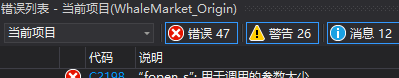

# Whale_Market

*****

#### 灵感来源：[B站up主“爱扑bug的熊”的视频](https://b23.tv/VXcekpT)
#### 上方视频中up主提供了[参考代码](https://github.com/201220014/WhaleMarket)

代码基本是自己写的，主要是为了锻炼一下自己，而且那up写的代码实在一言难尽。如下是我改掉了一些错误（#include文件路径格式不对）后显示的：

很离谱，是吧。

basic.h中的"static const char* banner"参考自 
[此](https://github.com/201220014/WhaleMarket/blob/master/src/tools/hint.c)。
basic.h中的"static const char* menu[]"参考自 
[此](https://github.com/201220014/WhaleMarket/blob/master/src/menu/menu.c)。
其余代码全是自己写的，未参考网络上其它项目代码。
  
该项目是在疫情网课期间制作的，复课了只好暂停制作。
待暑假期间应会继续制作。
还计划为该项目制作一个网页，仍同个人网站一样用GitHub Pages托管服务。
  
代码使用Visual Studio Community 2022编写及调试。

**Visual Studio就是宇宙最强IDE！不接受任何反驳！**

*****

2022-06-09：修改了README.md部分内容。为Whale Market制作了图标。

2022-07-07：把图标从原来的400+KB压缩成了46.5KB。现在加载明显更快了。
